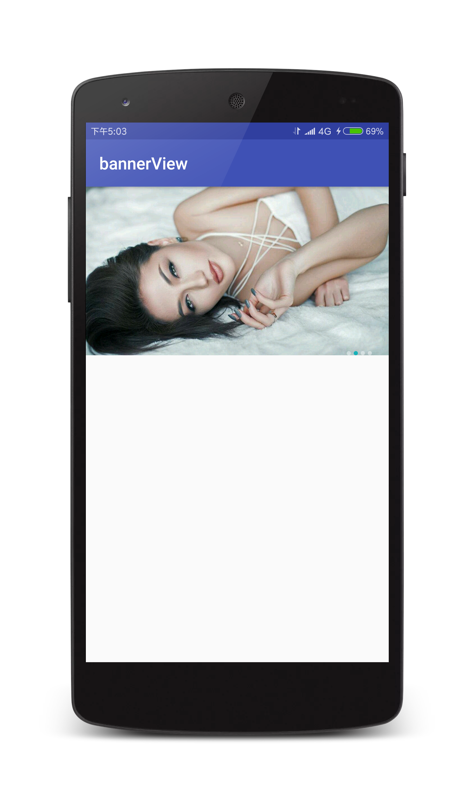

# BannerView

一个简单封装的BannerView

#### Demo 截图：
<a href="art/image1.png"></a>
<a href="art/image2.png"></a>

#### 引用：
```
allprojects {
    repositories {
        ...
        maven { url 'https://jitpack.io' }
    }
}

dependencies {
       compile 'com.github.lizixian18:bannerView:v1.0'
}
```
[](https://jitpack.io/#lizixian18/bannerView)

#### 用法：
```java 
String[] array = new String[]{
        "https://timgsa.baidu.com/timg?image&quality=80&size=b9999_10000&sec=1514186270980&di=3d717730f40285e7686dfaa13b1dd4cf&imgtype=0&src=http%3A%2F%2Fimage.tianjimedia.com%2FuploadImages%2F2015%2F209%2F42%2F6H182F668EP9.jpg",
        "https://timgsa.baidu.com/timg?image&quality=80&size=b9999_10000&sec=1514191976094&di=7348c7e235771dead0c86ec0319322c3&imgtype=0&src=http%3A%2F%2Fimgsrc.baidu.com%2Fimgad%2Fpic%2Fitem%2Fe1fe9925bc315c600dce09d386b1cb13495477b6.jpg",
        "https://timgsa.baidu.com/timg?image&quality=80&size=b9999_10000&sec=1514191994287&di=e624a24a8811428c0b6ecef893979bad&imgtype=0&src=http%3A%2F%2Fimgsrc.baidu.com%2Fimgad%2Fpic%2Fitem%2F728da9773912b31bc2fe74138d18367adab4e17e.jpg",
        "https://timgsa.baidu.com/timg?image&quality=80&size=b9999_10000&sec=1514192006291&di=55e555fe0371ab049fe1f16674db776e&imgtype=0&src=http%3A%2F%2Fimg.tupianzj.com%2Fuploads%2Fallimg%2F160519%2F9-160519202315.jpg"
};
mBannerView
        .build(Arrays.asList(array), new BannerView.ViewHolderCreator<String>() {

            @Override
            public View createHolderView(String url) {
                View bannerView = View.inflate(MainActivity.this, R.layout.item_banner, null);
                ImageView mImageBanner = bannerView.findViewById(R.id.image);
                Glide.with(MainActivity.this).load(url).into(mImageBanner);
                return bannerView;
            }
        });
```

#### Api:
```java
1. delayTime(int time)  设置轮播时间，单位秒，默认是5秒
2. setPointsRes(int selectRes, int unSelectRes)  设置下标drawable资源，选中和没选中两种状态
3. setPointsParams(LinearLayout.LayoutParams paramsNormal, LinearLayout.LayoutParams paramsSelect) 设置下标资源的LayoutParams
4. setPointsGravity(int gravity) 设置下标的位置，有三种：Gravity.LEFT，Gravity.CENTER，Gravity.RIGHT
5. setPointsMargin(int leftMargin, int topMargin, int rightMargin, int bottomMargin) 设置下标的边距
6. setOnItemClickListener(ViewPagerOnItemClickListener mViewPagerOnItemClickListener) 设置点击事件
7. setPageChangeListener(onPageChangeListener pageChangeListener) 监听当前到第几页
```

#### About me
An android developer in GuangZhou
简书：[http://www.jianshu.com/users/286f9ad9c417/latest_articles](http://www.jianshu.com/users/286f9ad9c417/latest_articles)   
Email:386707112@qq.com  
If you want to make friends with me, You can give me a Email and follow me。

#### License
```
Copyright 2018 L_Xian   
 
Licensed under the Apache License, Version 2.0 (the "License");  
you may not use this file except in compliance with the License.  
You may obtain a copy of the License at  

http://www.apache.org/licenses/LICENSE-2.0  

Unless required by applicable law or agreed to in writing, software  
distributed under the License is distributed on an "AS IS" BASIS,  
WITHOUT WARRANTIES OR CONDITIONS OF ANY KIND, either express or implied.  
See the License for the specific language governing permissions and  
limitations under the License.
```


